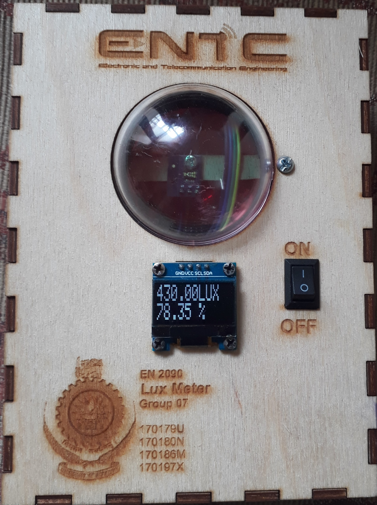
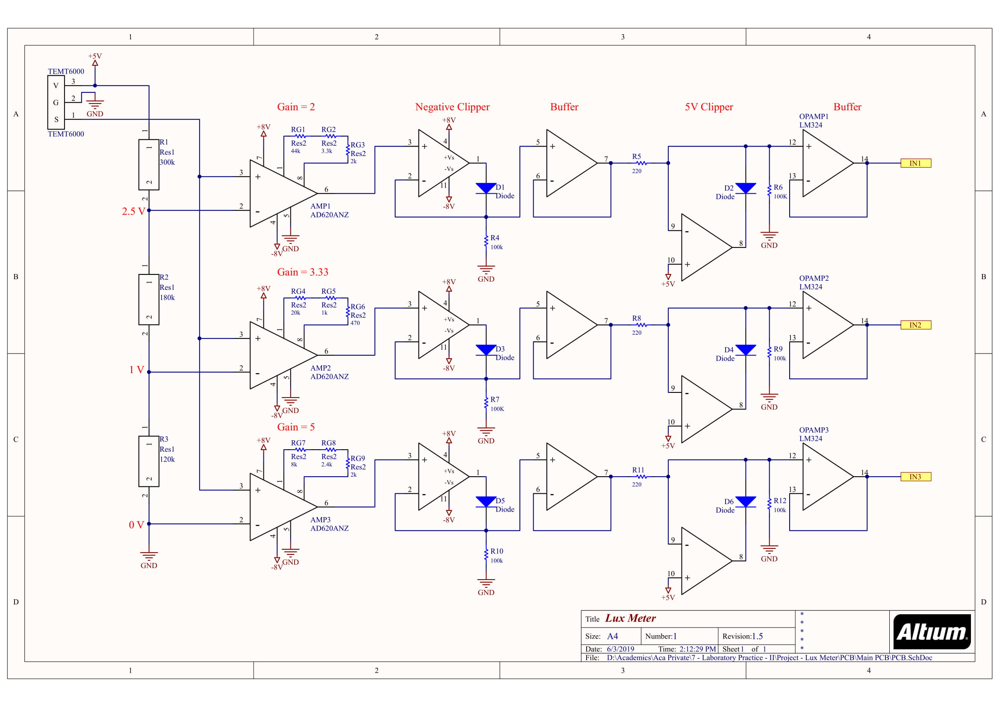
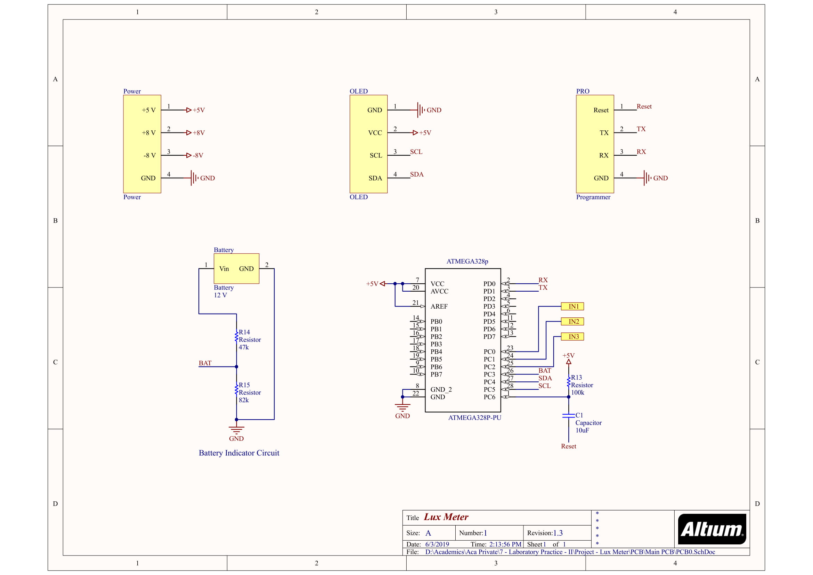
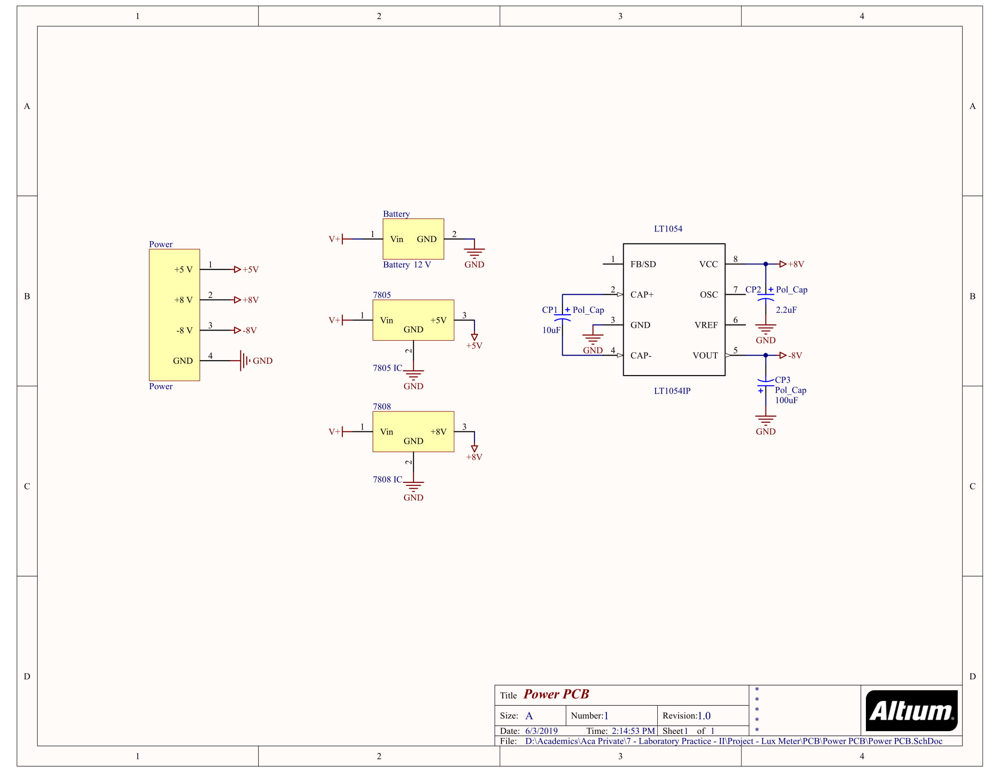
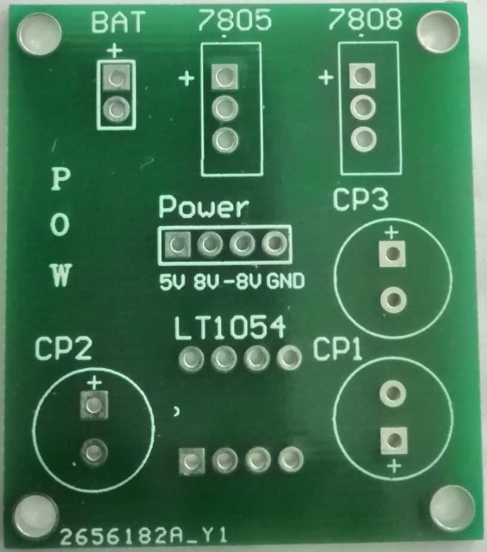
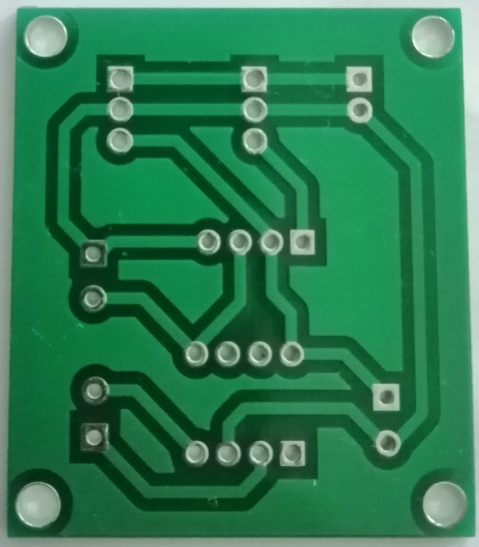
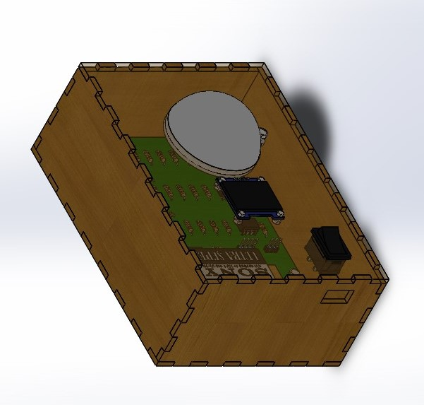
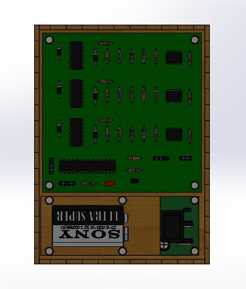
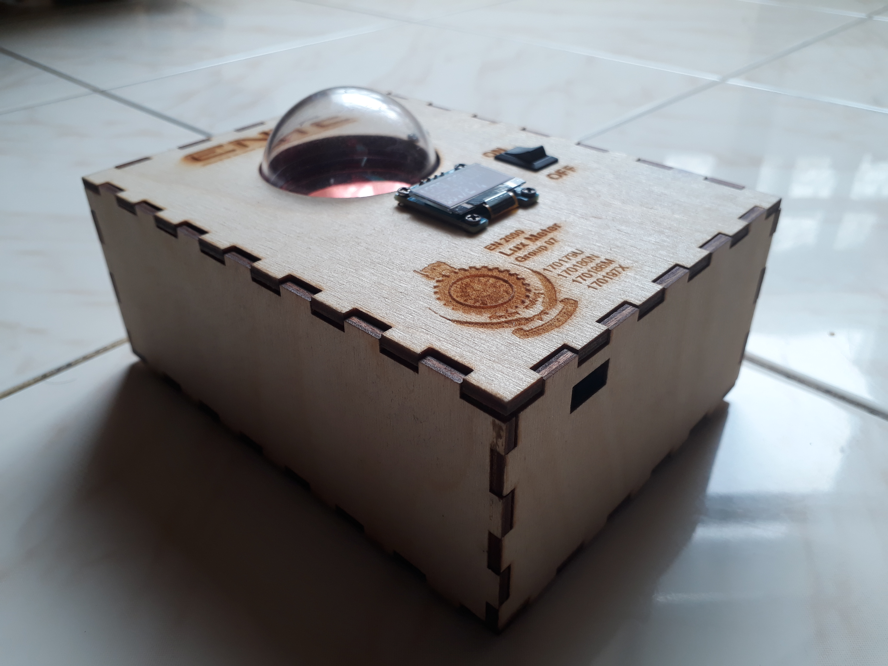

# Lux Meter

## ENTC -  Semester 2 Project

### __MEASUREMENT__

* **Quantity** - Illuminance
* **Measurement Unit**   - Lux _(lx)_ _[[Lux - Wikipedia](https://en.wikipedia.org/wiki/Lux)]_ 
* **Definition** - Illuminance _(lx)_ = luminous flux _(lm)_ per unit area _(m2)_

### __INTRODUCTION__

 
The lux value which was also called the luminance is a measure of amount of luminous flux per unit area (1m2). This value varies massively from location to location with a minute difference in luminance. Though human eye is very sensitive to luminance, the feature luminance is immeasurable to the human eye. The designed “LUX METER” which is very accurate, high in resolution, reasonably good range of measurable luminance and distance from light source. Whether commercial lux meters are consists of complicated parts and many advanced ICs, we were instructed to use basic analogue electronic components such as operational amplifiers, transistors, diodes etc.

 
We chose <i>TEMT6000</i> phototransistor module as the main sensor after analyzing several other sensing components. The linearity of light intensity with the output voltage and high sensitivity in visible range caused to choose <i>TEMT6000</i> photo transistor as sensor. Then for the processing part we used an Atmega328P microcontroller as it’s the chip used in the Arduino UNO so we can easily reprogram it for our purpose. Our device also has LCD display, from which the results can be easily viewed. 9v battery used as a power supply to this device. By measuring our device’s performance metrics with a commercially available lux meter and we made changes in our device to achieve high performance metrics.

 
Proposed lux meter is a combination of several types of amplifiers, rectifiers, clippers which is designed choosing most appropriate components. However, we had to face several difficulties such as limitations of the sensor and other components, designing and implementing the design.

### __COMPONENTS__

1. TEMT6000 Phototransistor
2. AD620 Instrumentation Amplifiers
3. LT1054 Switched Capacitor Voltage Inverter IC
4. LM324 Quad Operational Amplifier IC
5. 1N4001 Diodes
6. L7808 & L7805 Regulators
7. Atmega328P Microcontroller
8. OLED Display
9. 9V Battery
10. IR filter lens
11. Capacitors, Resistors, LEDs
12. Connector Cables & Sockets

### __SCHEMATICS__

### __PCB DESIGN__ - ALTIUM DESIGNER

&#160;&#160;&#160; 

### __CAD DESIGN__ - SOLIDWORKS

&#160;&#160;&#160; 

### __FINISHED DESIGN__

&#160;&#160;&#160; 

